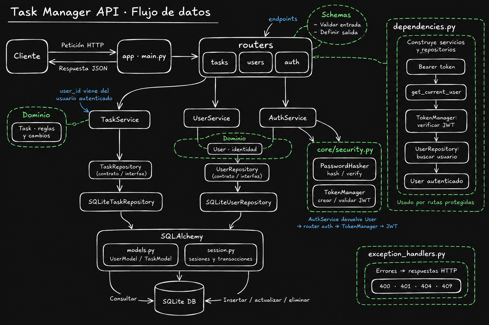

# Task Manager API

API desarrollada con FastAPI para que cada usuario gestione sus propias tareas. Permite crearlas, consultarlas, modificarlas, eliminarlas y consultar las caducadas. Los datos se guardan en SQLite y las operaciones protegidas requieren un token JWT.

Cada tarea tiene título, contenido, fecha límite, estado (`Not Started`, `In Progress` o `Done`) y prioridad (`Low`, `Medium` o `High`). Una tarea está caducada cuando su fecha límite ha pasado, incluso si está completada.

## Cómo leer el mapa

El recorrido habitual es **cliente → router → servicio → repositorio → SQLite**. La respuesta vuelve al cliente como JSON. Los contratos describen las operaciones disponibles: no son un paso adicional que procese los datos.

| Módulo | Responsabilidad |
| --- | --- |
| `main.py` | Crea la aplicación, registra routers y manejadores de errores e inicializa las tablas al arrancar. |
| `routers/` | Define los endpoints de usuarios, autenticación y tareas, y conecta las peticiones HTTP con los servicios. |
| `schemas/` | Valida los datos recibidos y define los campos de las respuestas. |
| `dependencies.py` | Proporciona sesiones, repositorios y servicios a los endpoints. También identifica al usuario autenticado. |
| `services/` | Coordina el registro, la comprobación de credenciales y las operaciones sobre las tareas. |
| `domain/` | Contiene `User`, `Task`, sus enumeraciones y las reglas de las entidades, como validar o cambiar el estado de una tarea. |
| `repositories/` | Define los contratos e implementa el acceso a SQLite, convirtiendo entidades de dominio en modelos de almacenamiento y viceversa. |
| `db/` | Define las tablas con SQLAlchemy y configura las conexiones y sesiones. |
| `core/` | Contiene configuración, seguridad y excepciones de aplicación. |
| `exception_handlers.py` | Traduce las excepciones esperadas a respuestas HTTP. |

Los servicios dependen de contratos como `TaskRepository`; `dependencies.py` les proporciona implementaciones como `SQLiteTaskRepository`. Esta separación permite cambiar el almacenamiento sin modificar la lógica del servicio.

## Usuarios y autenticación

**Registro:** el cliente envía nombre de usuario, correo y contraseña. El schema valida los datos y `UserService` comprueba que el nombre y el correo no estén registrados. `PasswordHasher` genera el hash de la contraseña y el repositorio guarda el usuario. La respuesta contiene su ID y nombre; nunca la contraseña ni su hash.

**Login:** el cliente envía sus credenciales como formulario. `AuthService` recupera al usuario y verifica la contraseña. Si son correctas, el router utiliza `TokenManager` para generar un JWT firmado con el identificador del usuario y una fecha de caducidad.

**Peticiones protegidas:** el cliente envía `Authorization: Bearer <token>`. La dependencia `get_current_user` valida el JWT y recupera al usuario antes de ejecutar el endpoint. `/users/me` devuelve los datos públicos de ese usuario.

## Gestión de tareas

Al crear una tarea, el schema valida los campos y el router entrega los datos a `TaskService`, junto con el ID del usuario autenticado. El servicio construye una entidad `Task` y el repositorio la guarda utilizando `TaskModel` y una sesión de SQLAlchemy.

Para modificarla, el servicio recupera la tarea, aplica únicamente los cambios enviados mediante sus métodos de dominio y solicita al repositorio que los guarde. Cambiar el estado a `Done` la marca como completada.

Las consultas y eliminaciones se limitan al propietario. El cliente no elige el `user_id`: se obtiene de la autenticación. Una tarea inexistente o perteneciente a otro usuario devuelve `404`. La consulta de caducadas filtra por propietario y por fecha límite anterior al momento actual.

## Endpoints

| Método y ruta | Función | Requiere token |
| --- | --- | --- |
| `POST /users` | Registrar un usuario. | No |
| `POST /auth/login` | Obtener un JWT mediante usuario y contraseña. | No |
| `GET /users/me` | Consultar el usuario autenticado. | Sí |
| `POST /tasks` | Crear una tarea. | Sí |
| `GET /tasks` | Listar las tareas propias. | Sí |
| `GET /tasks/expired` | Listar las tareas propias caducadas. | Sí |
| `GET /tasks/{task_id}` | Consultar una tarea propia. | Sí |
| `PATCH /tasks/{task_id}` | Modificar los campos enviados de una tarea. | Sí |
| `DELETE /tasks/{task_id}` | Eliminar una tarea propia. | Sí |

Las creaciones devuelven `201`, las consultas y actualizaciones `200`, y la eliminación `204` sin cuerpo. Los errores esperados se traducen a `400` para una actualización vacía, `401` para autenticación inválida, `404` para una tarea no encontrada y `409` para usuarios o correos duplicados. Los datos que incumplen los schemas generan `422`.

## Comprobación

Con la API arrancada, `/docs` permite explorar y probar los endpoints desde Swagger. El script `tests/test_python.py` utiliza `requests` contra `localhost` para comprobar creación, consulta, finalización, caducidad y una petición incorrecta que debe devolver `400`:

```bash
python tests/test_python.py
```

Cada ejecución crea un usuario de prueba y elimina sus tareas al terminar. El usuario permanece porque no hay un endpoint para borrarlo.
